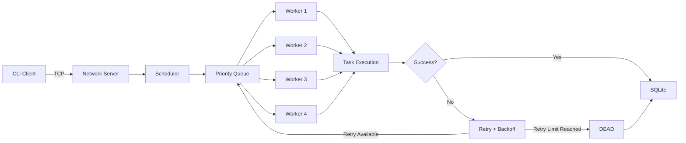

<div align="center">

<a href="https://github.com/Nanjundi15/AeroTask">
  
</a>

<br/>


<br/><br/>

[](https://en.cppreference.com/w/c/11)
[](https://learn.microsoft.com/windows/wsl/)
[](https://sqlite.org/)
[](https://cmake.org/)
[](https://www.gnu.org/software/make/)
[](https://github.com/Nanjundi15/AeroTask/actions)
[](https://www.docker.com/)

<br/><br/>

<a href="https://github.com/Nanjundi15/AeroTask">
  
</a>

<a href="https://github.com/Nanjundi15/AeroTask/stargazers">
  
</a>

<a href="https://github.com/Nanjundi15/AeroTask/actions">
  
</a>

<a href="https://github.com/Nanjundi15/AeroTask/issues">
  
</a>

<br/><br/>

**🧪 Try It Locally:** Clone the repository, build it with `make`, start the TCP server, and run the client demo in two terminals.

</div>

---

# 🚀 What is AeroTask?

**AeroTask** is a lightweight, high-performance **task scheduling and job-processing system written in C**.

The project demonstrates how a backend task can move through a complete execution pipeline:

```text
Client
  │
  ▼
TCP Server
  │
  ▼
Priority Queue
  │
  ▼
Worker Pool
(4 pthread workers)
  │
  ├──► Success ───────────────► SQLite
  │
  └──► Failure
         │
         ▼
   Exponential Backoff
         │
         ├──► Retry
         │
         └──► Dead-Letter State
```

AeroTask is intentionally designed to run locally so the core systems concepts can be demonstrated **without requiring a paid cloud subscription**.

The project focuses on practical engineering concepts used in backend, infrastructure, platform and cloud systems:

* Concurrency
* Scheduling
* Networking
* Persistence
* Failure recovery
* Retry strategies
* Testing
* CI/CD
* Containerization

---

# ⚡ Try AeroTask

Want to try the project yourself?

### 🔗 Repository

**https://github.com/Nanjundi15/AeroTask**

### 🧪 Quick Start

```bash
git clone https://github.com/Nanjundi15/AeroTask.git
cd AeroTask

make
make test
```

Expected:

```text
test_queue: PASS
```

Start the server:

```bash
mkdir -p data
./build/aerotask-server 8080
```

Open a **second terminal**:

```bash
cd AeroTask
```

Check server health:

```bash
./build/aerotask-client 127.0.0.1 8080 health
```

Expected:

```text
OK HEALTH queue=0
```

Submit your first task:

```bash
./build/aerotask-client 127.0.0.1 8080 submit 10 "critical_backup"
```

Check it:

```bash
./build/aerotask-client 127.0.0.1 8080 status 1
```

Example:

```text
TASK 1 | COMPLETED | priority=10 | retries=0/3 | worker=2 | error=
```

### 🔥 Test the failure-recovery path

```bash
./build/aerotask-client 127.0.0.1 8080 submit 10 "fail_retry_demo"
```

After the retry cycle:

```text
TASK 2 | DEAD | priority=10 | retries=3/3 | worker=1 | error=Simulated worker failure
```

This demonstrates:

```text
PENDING
   ↓
WORKER
   ↓
FAILURE
   ↓
RETRY 1
   ↓
RETRY 2
   ↓
RETRY 3
   ↓
DEAD
```

> **No cloud subscription is required to try the project.**

---

# 🎯 Why AeroTask?

AeroTask was built to go below high-level application frameworks and understand the engineering concepts underneath modern backend and cloud systems.

It connects:

```text
C / Systems
      ↓
Networking
      ↓
Concurrency
      ↓
Scheduling
      ↓
Persistence
      ↓
Reliability
      ↓
Testing + CI
      ↓
Cloud / Infrastructure Foundations
```

The project is especially relevant to:

**Software Engineering • Backend Engineering • Cloud Engineering • Platform Engineering • Systems Programming • DevOps**

---

# ✨ Core Features

## ⚡ Priority-Based Scheduling

Tasks carry a priority value and are inserted into the scheduling queue based on priority.

```text
Priority 10  → Critical
Priority 5   → Medium
Priority 1   → Low
```

Example:

```bash
./build/aerotask-client 127.0.0.1 8080 submit 10 "high_priority_task"
```

---

## 🧵 Multithreaded Worker Pool

AeroTask starts **4 worker threads** using POSIX `pthread`.

```text
             ┌──────────────────┐
             │   Priority Queue │
             └────────┬─────────┘
                      │
          ┌───────────┼───────────┐
          ▼           ▼           ▼           ▼
      Worker 1    Worker 2    Worker 3    Worker 4
```

Workers independently consume tasks from the shared queue and execute them concurrently.

---

## 🔁 Automatic Retries

Failed tasks are retried using exponential backoff.

```text
Failure
  ↓
Retry 1 → 1 second
  ↓
Retry 2 → 2 seconds
  ↓
Retry 3 → 4 seconds
  ↓
DEAD
```

This prevents an immediately failing task from being retried continuously.

---

## 💀 Dead-Letter Handling

When the configured retry limit is reached, the task moves to:

```text
DEAD
```

instead of being retried forever.

Example:

```text
TASK 2 | DEAD | priority=10 | retries=3/3
```

---

## 💾 SQLite Persistence

Task state is persisted locally using SQLite:

```text
data/aerotask.db
```

This allows the system to maintain task information beyond in-memory queue processing.

---

## 🌐 TCP Client / Server

The client communicates with the server over TCP:

```text
┌────────────────────┐
│  aerotask-client   │
└─────────┬──────────┘
          │
          │ TCP
          ▼
┌────────────────────┐
│  aerotask-server   │
└────────────────────┘
```

---

## 🩺 Health & Operations

Built-in commands provide basic operational visibility:

```text
health
submit <priority> <task_name>
status <task_id>
list
stats
```

Example:

```bash
./build/aerotask-client 127.0.0.1 8080 health
```

```text
OK HEALTH queue=0
```

---

# 🏗️ Architecture



---

# 📊 Task Lifecycle

```text
                ┌──────────┐
                │ PENDING  │
                └────┬─────┘
                     │
                     ▼
                ┌──────────┐
                │ RUNNING  │
                └────┬─────┘
                     │
              ┌──────┴──────┐
              ▼             ▼
         ┌──────────┐   ┌───────────┐
         │COMPLETED │   │  FAILED   │
         └──────────┘   └─────┬─────┘
                               │
                               ▼
                         ┌──────────┐
                         │ RETRYING │
                         └────┬─────┘
                              │
                    retries remaining?
                       /           \
                     yes            no
                      │              │
                      ▼              ▼
                  PENDING          DEAD
```

---

# 🧠 Engineering Concepts Demonstrated

AeroTask brings together several important systems and backend concepts:

```text
Concurrency
    ↓
Thread Synchronization
    ↓
Producer / Consumer Scheduling
    ↓
Priority-Based Dispatch
    ↓
TCP/IP Communication
    ↓
Failure Recovery
    ↓
Exponential Backoff
    ↓
Persistence
    ↓
Testing
    ↓
CI/CD
```

This makes the project a practical demonstration of:

* Systems programming
* Backend engineering
* Reliability engineering
* Infrastructure fundamentals

---

# 📁 Project Structure

```text
AeroTask/
├── .github/
│   └── workflows/
│       └── ci.yml
│
├── client/
│   └── client.c
│
├── docs/
│   └── architecture.md
│
├── include/
│   ├── common.h
│   ├── logger.h
│   ├── network.h
│   ├── queue.h
│   ├── scheduler.h
│   └── storage.h
│
├── scripts/
│   └── run_demo.sh
│
├── src/
│   ├── common.c
│   ├── logger.c
│   ├── network.c
│   ├── queue.c
│   ├── scheduler.c
│   ├── server.c
│   └── storage.c
│
├── tests/
│   └── test_queue.c
│
├── CMakeLists.txt
├── Dockerfile
├── Makefile
├── README.md
└── .gitignore
```

---

# 🛠️ Tech Stack

| Layer            | Technology                |
| ---------------- | ------------------------- |
| Language         | C11                       |
| Concurrency      | POSIX Threads (`pthread`) |
| Networking       | TCP/IP sockets            |
| Scheduling       | Priority Queue            |
| Persistence      | SQLite3                   |
| Build            | GNU Make, CMake           |
| Testing          | C Test Executable         |
| CI               | GitHub Actions            |
| Environment      | Ubuntu / WSL2             |
| Containerization | Docker                    |

---

# 💻 Run Locally

## Prerequisites

* Ubuntu / WSL2
* GCC
* Make
* SQLite3 development libraries
* Git

## Install Dependencies

```bash
sudo apt update
sudo apt install build-essential sqlite3 libsqlite3-dev git -y
```

## Clone

```bash
git clone https://github.com/Nanjundi15/AeroTask.git
cd AeroTask
```

## Build

```bash
make
```

## Run Tests

```bash
make test
```

Expected:

```text
./build/test_queue
test_queue: PASS
```

## Start Server

```bash
mkdir -p data
./build/aerotask-server 8080
```

Expected:

```text
AeroTask server listening on port 8080
```

---

# 🎮 Complete Demo

Open a second terminal.

## 1. Health Check

```bash
./build/aerotask-client 127.0.0.1 8080 health
```

Expected:

```text
OK HEALTH queue=0
```

---

## 2. Submit a Task

```bash
./build/aerotask-client 127.0.0.1 8080 submit 10 "critical_backup"
```

Expected:

```text
OK task_id=1 status=PENDING
```

---

## 3. Check Task Status

```bash
./build/aerotask-client 127.0.0.1 8080 status 1
```

Example:

```text
TASK 1 | COMPLETED | priority=10 | retries=0/3 | worker=2 | error=
```

---

## 4. Test Retry + Dead-Letter Handling

A task containing `fail` intentionally triggers the deterministic failure path used for testing.

```bash
./build/aerotask-client 127.0.0.1 8080 submit 10 "fail_retry_demo"
```

After the retry cycle:

```text
TASK 2 | DEAD | priority=10 | retries=3/3 | worker=1 | error=Simulated worker failure
```

---

## 5. View Statistics

```bash
./build/aerotask-client 127.0.0.1 8080 stats
```

Statistics are printed on the server console.

Example:

```text
Task statistics:
  COMPLETED   1
  DEAD        1
```

---

## 6. List Tasks

```bash
./build/aerotask-client 127.0.0.1 8080 list
```

Example:

```text
ID   PRIORITY STATUS      RETRIES WORKER NAME
---------------------------------------------------------------
2    10       DEAD        3       1      fail_retry_demo
1    10       COMPLETED   0       2      critical_backup
```

---

# 🧪 Testing

The project includes an automated queue test:

```bash
make test
```

Expected:

```text
test_queue: PASS
```

The end-to-end implementation has been manually verified for:

* ✅ TCP client/server communication
* ✅ Task submission
* ✅ Worker execution
* ✅ SQLite persistence
* ✅ Priority values
* ✅ Retry handling
* ✅ Exponential backoff
* ✅ Dead-letter state
* ✅ 4-worker execution
* ✅ Health checks
* ✅ Task statistics
* ✅ Task listing

---

# 🔐 Engineering & Safety Notes

AeroTask's failure demonstration is deterministic and based on the task name.

Examples:

```text
fail_demo
fail_retry_demo
fail_final
```

The scheduler **does not execute arbitrary shell commands from submitted task names**.

This keeps the demonstration predictable and avoids turning the scheduler into an arbitrary command-execution mechanism.

---

# 🐳 Docker

Build the image:

```bash
docker build -t aerotask .
```

Run:

```bash
docker run --rm -p 8080:8080 aerotask
```

Docker support is included as a packaging and deployment option.

The primary development environment is Ubuntu / WSL2.

---

# 🔄 CI / GitHub Actions

GitHub Actions configuration is available at:

```text
.github/workflows/ci.yml
```

The workflow is intended to validate the project build and tests on repository events such as pushes and pull requests.

View CI:

**https://github.com/Nanjundi15/AeroTask/actions**

---

# 🎯 Why AeroTask Matters

AeroTask was intentionally built to strengthen engineering skills beyond framework-level development.

It combines:

```text
C
+
Networking
+
Concurrency
+
Scheduling
+
Persistence
+
Reliability
+
Testing
+
CI/CD
```

These concepts transfer directly into backend, cloud, infrastructure and platform engineering.

---

# 🔗 How It Connects to Modern Cloud Systems

AeroTask is a local implementation of patterns commonly found in larger backend and cloud architectures.

```text
AeroTask
   │
   ├── Task Queue
   ├── Worker Pool
   ├── Retry Policy
   ├── Health Checks
   └── Persistence
```

These concepts can later be extended toward:

```text
Message Queues
Background Workers
Containers
Kubernetes
Managed Cloud Services
Distributed Processing
Observability
```

The current implementation intentionally keeps the system local so the underlying concepts remain easy to understand and demonstrate.

---

# 🚧 Future Enhancements

Planned directions:

* [ ] Worker heartbeat and health monitoring
* [ ] Graceful server shutdown with queue draining
* [ ] Configurable worker count
* [ ] Configurable retry policies
* [ ] Metrics endpoint
* [ ] Structured JSON logs
* [ ] Authentication for client connections
* [ ] Rate limiting
* [ ] REST API gateway
* [ ] Redis-backed distributed queue
* [ ] PostgreSQL storage option
* [ ] Cloud deployment
* [ ] Benchmark suite
* [ ] Latency measurements
* [ ] Load testing
* [ ] Integration test framework
* [ ] Web-based monitoring dashboard

---

# 📚 Learning Outcomes

Building AeroTask provided hands-on experience with:

* C systems programming
* POSIX threads
* Thread synchronization
* TCP sockets
* Client/server architecture
* Scheduling algorithms
* Priority queues
* SQLite database operations
* Retry strategies
* Exponential backoff
* Fault handling
* Dead-letter processing
* Build automation
* Docker
* Git
* GitHub Actions
* CI/CD fundamentals

---

# 👨‍💻 Author

<div align="center">

## Nanjundi K

**Software Engineer | AI/ML | Cloud | Backend | Systems**

<br/>

<a href="https://github.com/Nanjundi15">
  
</a>

<a href="https://github.com/Nanjundi15/AeroTask">
  
</a>

</div>

---

# ⭐ Support

If AeroTask is useful for learning, experimentation, or reference, consider giving the repository a ⭐.

<div align="center">

**Built with C, pthreads, TCP sockets, SQLite and a lot of debugging.**

<br/>

<a href="https://github.com/Nanjundi15/AeroTask">
  
</a>

<br/><br/>


</div>

---

# 📄 License

A license has not been added to the repository yet.

Add a `LICENSE` file when you decide which open-source license you want to use.
